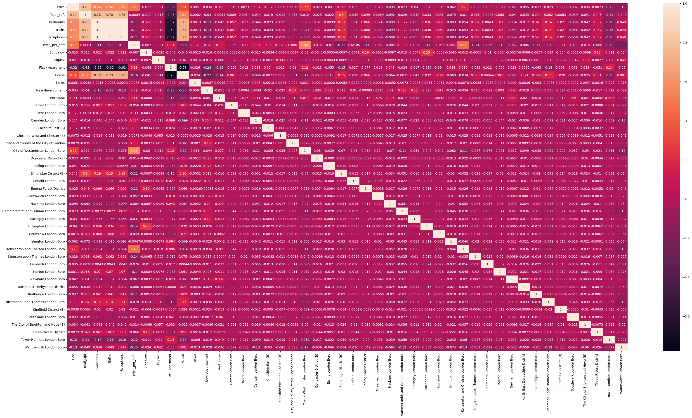

# London-House-Price-Prediction

 This is an end to end Data Science project which goes through the process of how to build a real estate price prediction website. The first part of the project is building a model using sklearn and Decision Tree Regressor using a London home prices dataset from Kaggle.com. After building the model, the next step was to build a Python Flask server that used the saved Decision Tree model to serve http requests. The third component of the project was building a website in HTML, CSS and JavaScript that would allow a user to enter select and enter the attributes of the house they are looking for Total square feet area, Number of Bedrooms, Receptions etc and will call the python flask server to retrieve the predicted price. During the model building phase, all the Data Science concepts such as data load and cleaning,  outlieer detection and removal, feature engineering, dimensionality reduciton, gridsearchcv for hypyerparameter tuning, K-fold cross validation are covered. MLOps model deployment was also explored in this project for the model to be able to run on a remote server for the website. An additional concept which was essential to finding the location names and correcting the Postcodes for the houses to this data set was Fuzzymatching.

Deployed Website : www.londonplaces.online

## Business problem
When people are looking for a house to purchase, they may not know what the market place is like and what to expect in terms of prices. The real estate website of the city of London could help counter that problem for individuals who are looking for houses with certain types of specifications and are helped to estimate the price of that house without having to contact a middleman or real estate agent who would charge them some money. 

 File Structure:
 model - contains the jupyter notebook file, saved model and dataset files 
 server - contains Flask server code and artifacts like the model used for the backend operations of the   website
 client - contains the HTML and CSS code for the Real estate website
 
## Technology tools used in this project:
1. Python
2. Numpy and Pandas for data cleaning 
3. Seaborn and Matplotlib for data visualization
4. Sklearn for model building
5. Jupyter notebook, visual studio and pycharm as Intergrated Development Enviroments (IDE)
6. Python flask for http server 
7. HTML/CSS/Javascript User Interface website
8. Nginx, WinSCP and AWS for deployment of model

## Quick glance at the results

Correlation between the features 

Results of the models used in experimentation (with gridsearched parameters)

- The final model used for this project was the Random Forest Regressor
- The metric which was used to assess the accuracy of the Regression models was the R2 score

## Lessons learned and recommendations
From firstly using the simple Decision Tree regression model, I observed that it easily overfit on one feature of the dataset. This was shown when the predictions of the model would change when only one feature; Total_sqft would be altered in experimentation.

## Recommendations: 
- When using a high dimensional dataset, ensemble models like Random Forest Tree Regressors are better for the task as they are complex enough not to overfit. An ensemble of decision trees is trained on random subsets of the data and features. This randomization helps reduce overfitting compared to individual decision trees 
- If no quality dataset is found, Scrapping the dataset yourself from the internet would be a better option.

## Limitations and what can be improved 
- The dataset used did not have enough entries to have significant variance in the districts of London. This caused all of the districts to have the same pricing by the model because they did not have much correlation with the price of houses
